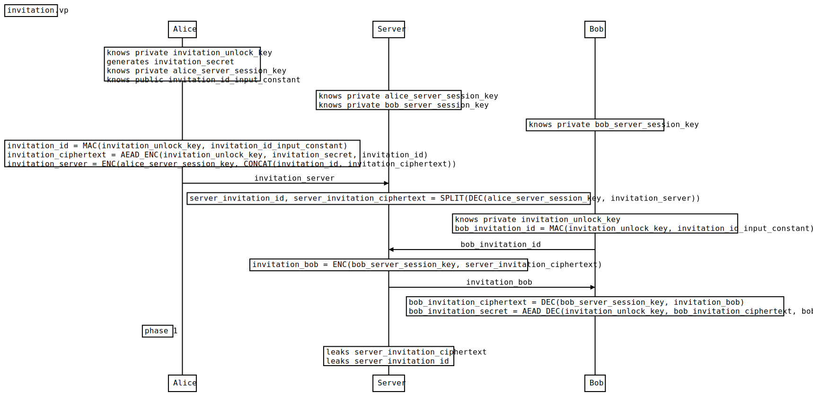

# Invitation scheme for end-to-end encrypted systems

Status: Draft (looking for feedback)

## Introduction

This document describes a system for invitation links for end-to-end encrypted systems where the invitee can open an invitation link and get access to the encrypted data right away via a relay server, but several measures are taken to ensure that the invitation link can't be used by an attacker who gains access to it later on.

## Motivation / Problem

In many end-to-end encrypted systems nowadays Trust On First Use (TOFU) is used to establish trust between users (Signal, iMessage, WhatsApp). Keybase argued for a different approach in their system where in a team trust is established through an invitation token shared by the team admin. They called it Seitan token: https://book.keybase.io/docs/teams/seitan

These can be used as part of invitation links. A very established concept in web applications. This was great, but there was one catch in terms of user experience. As a last step and admin had to be online to confirm the invitation. While this has some benefits in terms of security, it is a terrible user experience since it's not instant and hard to set expectations for the user since it requires the admin to go online.

## Design

The basic idea is still to have an invitation link that can be shared with the invitee. The server at no point can access the content. The server is only trusted with the ciphertext.

What's different though is that several measures are taken to ensure an invitation link, which is leaked later on will not give access to the encrypted data.

The measures:

- The ciphertext of the invitation is encrypted in transit between the inviter and the server
- The ciphertext of the invitation is stored encrypted at rest on the server and the table should be excluded from backups.
- The ciphertext of the invitation is remove from the server after invitation become invalid (must be after a certain duration and in addition optionally after a fixed number of uses)

### Creating and storing the invitation on the server

```ts
// inviter
var invitation_secret; // can be the randomly generated seed to a key pair or the existing symmetric key
var invitation_unlock_key = random(32);
var invitation_ciphertext = aead_encrypt(
  invitation_secret,
  invitation_unlock_key
);
var invitation_id = hmac(invitation_unlock_key, "invitation_id");
var invitation_server_envelop = encrypt(
  inviter_server_session_key,
  concact(invitation_id, invitation_ciphertext)
);
```

```ts
// inviter -> server (invitation_server_envelop)
```

```ts
// server: decrypt and store invitation
var (invitation_id, invitation_ciphertext) = split(
  decrypt(
    inviter_server_session_key,
    invitation_server_envelop
  )
);
// the invitation_ciphertext is stored encrypted at rest
```

### Sharing the invitation link

```ts
// inviter -> invitee (invitation_secret)
```

### Retrieving and decrypting the invitation

```ts
// invitee: generate invitation id
var invitation_id = hmac(invitation_unlock_key, "invitation_id");
```

```ts
// invitee -> server (invitation_id)
```

```ts
// server
var invitation_server_envelop_for_invitee = encrypt(
  invitee_server_session_key,
  invitation_ciphertext
);
```

```ts
// server -> invitee: invitation_server_envelop_for_invitee
```

```ts
// invitee
var invitation_secret = aead_decrypt(
  invitation_ciphertext,
  invitation_unlock_key,
  invitation_id
);
```

### Server responsibilities

- The invitation_ciphertext must be removed after a certain duration e.g. 2 days.
- The invitation_ciphertext must not be included in backups.
- The invitation_ciphertext is only shared with an invitee providing the correct `invitation_id`.

#### Possible extensions

- The server could provide an endpoint to discard the invitation and remove the invitation_ciphertext before the expiration date. This is recommended to allow revoking the invitation.
- The server could add a counter to each invitation and remove the invitation_ciphertext after a certain number of uses. In this case it could also be included as AD (additional data) in the AEAD encryption of `invitation_ciphertext` and clients could verify that the invitation is not surpassed the number of uses.

### Run the Example Code

```sh
pnpm install
pnpm test
```

The example code can be found in [./src/test.ts](./src/test.ts).

### Formal Verification

The system was modeled and verified using Verifpal. The model can be found here [invitation.vp](./invitation.vp)

You can run it using:

```sh
verifpal verify invitation.vp
```

Note: `invitation_unlock_key` in the model is known by Alice (inviter) and Bob (invitee) since there is no declaration that it is shared over a secure channel.



## Threat Model

There are two adversaries in this system:

- The server
- An attacker who has access to the invitation link

### Server

The server is trusted only with encrypted data. The server could reject to collaborate creating the invitation or providing data to a client who has opened the invitation link, but all of these are not a big concern.

In addition the server could leak the ciphertext to unauthorized parties willingly or unwillingly.

### Attacker with access to the invitation link

Here we need to distinguish between two use-cases:

1. MITM attacker grabbing the invitation link
2. Attacker who gains access to the invitation link after some time e.g. by hacking the invitee's device or the DB of a chat application being leaked.

The system doesn't protect against a MITM attack, but aims to protect against the second use-case by relying on the honesty of the server.

## Notes

### Why generated the ID using an hmac from the `invitation_unlock_key`?

The `invitation_id` is generated from the `invitation_unlock_key` using an HMAC to bind them together. It was inspired by the work on Seitan token invitations.

### Accepting the invitation

When accepting an invitation the invitee must be able to add themselves to the resource (e.g. workspace, group, document) by creating the necessary resources e.g. a lockbox for a workspace key.

This also means other participants must be able to verify that the invitee is a full member. This highly depends on the existing system and is not part of this design.

### URL Design

The invitation secret must be part of the hash segment of the URL since the hash segment is not sent to the server by any browser.

Example:

`https://example.com/invitation/xyz#secret=abc`

### Key Rotation

In case you have system that supports key rotation the `invitation_secret` should be a seed to a private/public key pair. The public key should be attached to the invitation and treated by the participants as a full member e.g. in case lock boxes are used to share a workspace key on key rotation also a lockbox for the new key should be created.
